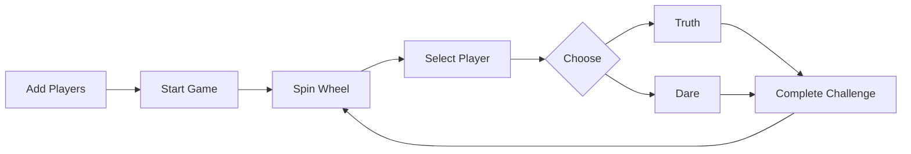

# 🎮 Truth or Dare Game 🎲

[](https://angular.io/)
[](https://www.typescriptlang.org/)
[](https://nodejs.org/)

## 📋 Project Description

> *Bring the classic party game to life with our digital Truth or Dare experience!*

The Truth or Dare game is a fun and interactive game designed to be played with friends. The game allows players to take turns spinning a wheel to select a player who then chooses between answering a truth question or performing a dare. The game is built using Angular and TypeScript, providing a smooth and engaging user experience.


## ✨ Features

| Feature | Description |
|---------|-------------|
| 🎡 **Spin the Wheel** | Randomly select the next player to take their turn |
| 👥 **Player Management** | Add and manage multiple players in a game session |
| 🎭 **Truth or Dare** | Choose between answering a truth question or performing a dare |
| 🔄 **Random Challenges** | Get unique truth questions and dares for each turn |
| 🎨 **Interactive UI** | Enjoy a visually appealing and responsive game interface |

## 🚀 Setup Instructions

### Prerequisites

- Node.js (v14 or higher)
- npm (v6 or higher)

### Installation Steps

1. Clone the repository:
   ```bash
   git clone https://github.com/Yash-Kavaiya/truth-or-dare.git
   cd truth-or-dare
   ```

2. Install dependencies:
   ```bash
   npm install
   ```

3. Start the development server:
   ```bash
   npm run dev
   ```

4. Open your browser and navigate to `http://localhost:3000` to see the application in action.

## 📱 Usage Instructions



### Step-by-Step Guide

1. **Add Players**
   - Add at least 2 players by entering their names and clicking the "Add Player" button
   - Each player will be assigned a unique color for identification

2. **Start Game**
   - Once you have added at least 2 players, click the "Start Game" button
   - The game board will appear with all players displayed

3. **Game Play**
   - The game will randomly select a player to take their turn
   - The selected player will choose between "Truth" or "Dare"
   - The player will be given a random truth question or dare to complete
   - After completing the challenge, the next player will take their turn

## 🛠️ Technologies Used

<table>
  <tr>
    <th>Category</th>
    <th>Technologies</th>
  </tr>
  <tr>
    <td>Frontend Framework</td>
    <td>Angular 19</td>
  </tr>
  <tr>
    <td>Programming Language</td>
    <td>TypeScript</td>
  </tr>
  <tr>
    <td>Styling</td>
    <td>CSS/SCSS</td>
  </tr>
  <tr>
    <td>Backend</td>
    <td>Node.js, Express</td>
  </tr>
  <tr>
    <td>Testing</td>
    <td>Jasmine, Karma</td>
  </tr>
</table>

## 🤝 Contribution Guidelines

We welcome contributions from the community! To contribute to the project, follow these steps:

### Contribution Process

1. **Fork the Repository**
   - Click the "Fork" button at the top right of this page

2. **Create a Branch**
   ```bash
   git checkout -b my-feature-branch
   ```

3. **Make Your Changes**
   - Implement your feature or fix
   - Ensure code follows project style guidelines
   - Add appropriate tests

4. **Commit Your Changes**
   ```bash
   git commit -m "Add new feature: brief description"
   ```

5. **Push to Your Fork**
   ```bash
   git push origin my-feature-branch
   ```

6. **Open a Pull Request**
   - Navigate to the original repository
   - Click "New Pull Request"
   - Select your fork and branch
   - Provide a clear description of your changes

## 🎯 Future Enhancements

> We're constantly working to improve the game experience! Here are some features we plan to implement:

- 📱 **Mobile Application** - Native mobile versions for iOS and Android
- 🌐 **Online Multiplayer** - Play with friends remotely
- 🎨 **Custom Themes** - Personalize the game appearance
- 📊 **Statistics Tracking** - Track players' performance over time
- 🎤 **Voice Recognition** - Voice-controlled game play

## 🙏 Acknowledgements

We would like to thank all the contributors who have helped make this project better. Your contributions are greatly appreciated!

---

<div align="center">
  <p>🎲 <b>Truth or Dare</b> - The ultimate party game for friends and fun! 🎮</p>
</div>
